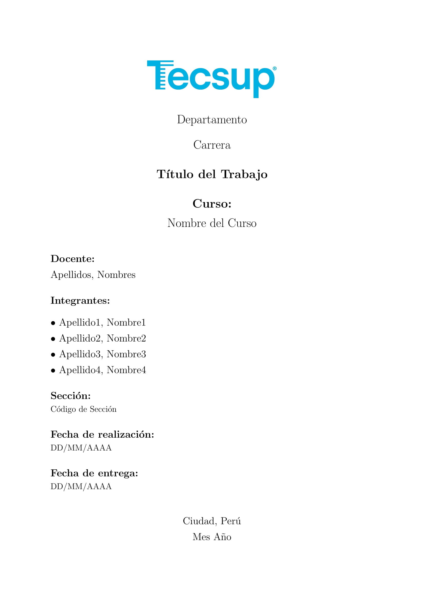
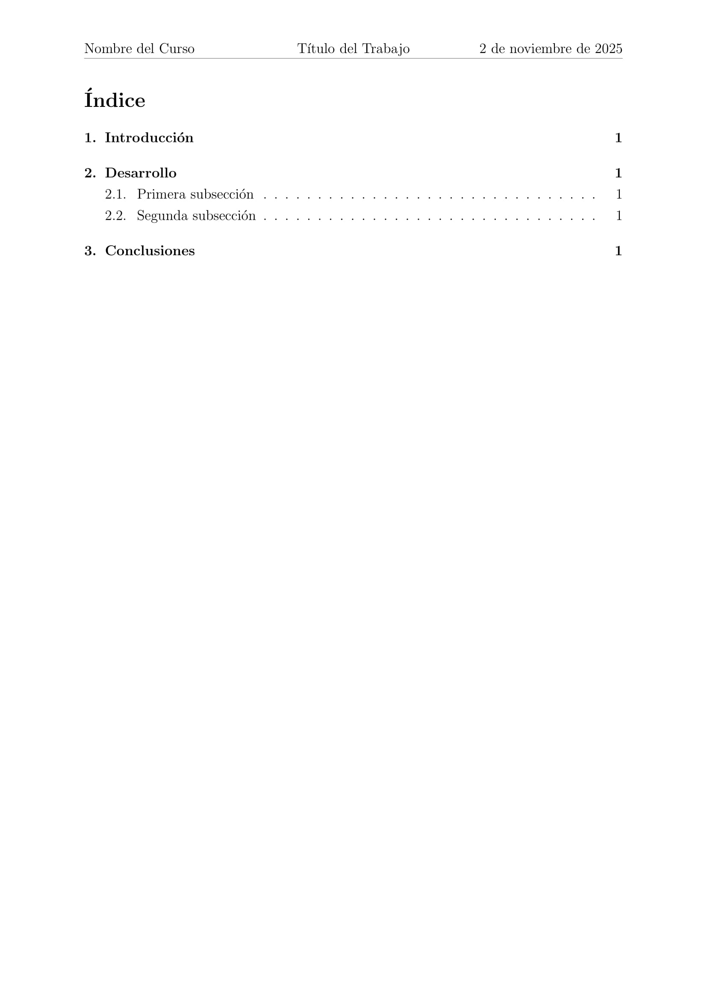
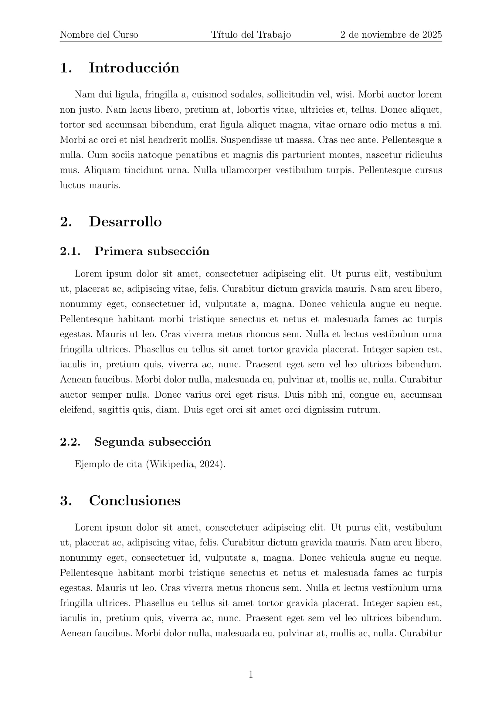
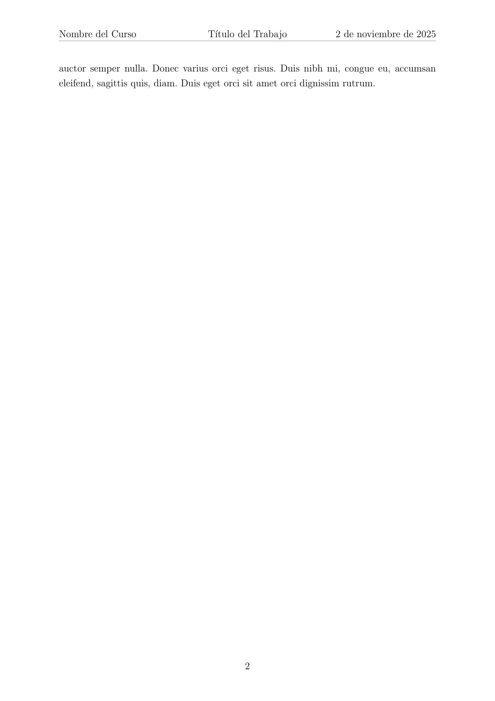
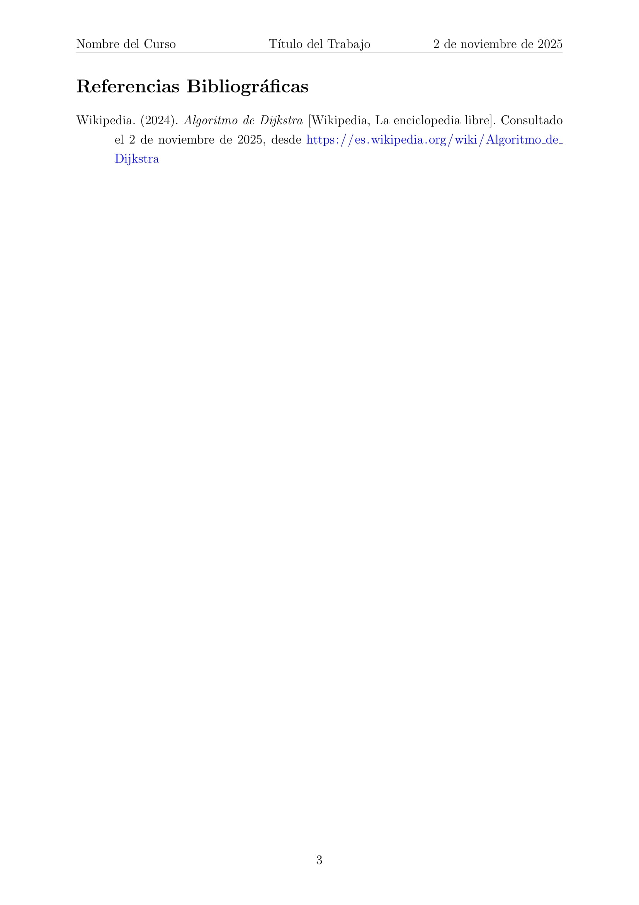

# Template LaTeX - Tecsup

Template personal en LaTeX para trabajos académicos.

## Vista Previa

### Portada


### Índice


### Contenido



### Bibliografía


## Uso

1. Clona el repositorio:
```bash
git clone https://github.com/tu-usuario/tecsup-latex-template.git
```

2. Edita el archivo `main.tex`

3. Compila:
```bash
pdflatex main.tex
```

## Estructura

```
.
├── img/
│   └── logo.png
├── main.tex          # Archivo principal
├── main.pdf          # PDF
├── reff.bib          # Archivo de bibliografía
```
